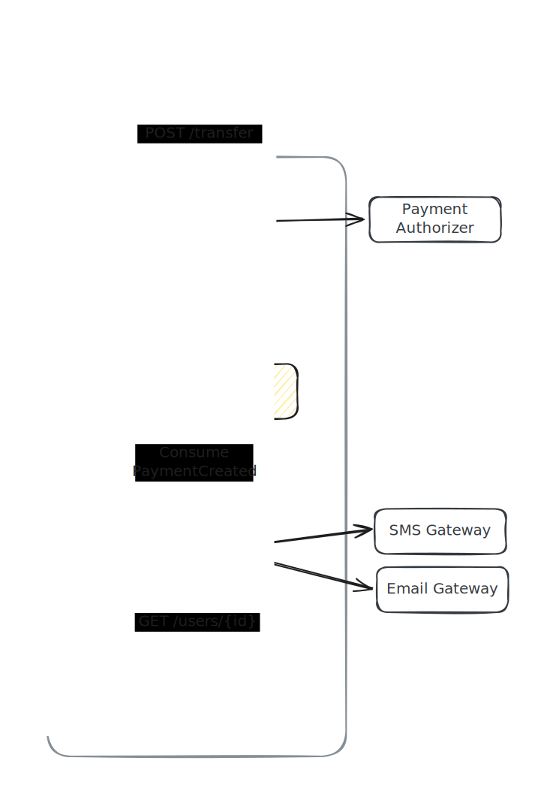
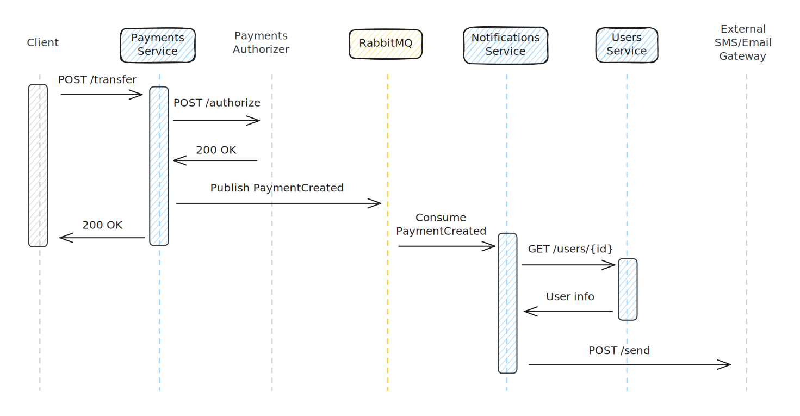

# Payments App

[](https://github.com/lhsazevedo/payments/actions/workflows/ci-payments.yml)
[](https://github.com/lhsazevedo/payments/actions/workflows/ci-users.yml)
[](https://github.com/lhsazevedo/payments/actions/workflows/ci-notification.yml)

High-performance, simplified payments service using PHP, Swoole and Nano, PostgreSQL, and RabbitMQ.

## Introduction
This payments API prioritizes request rate and low latency by leveraging Swoole's concurrent processing. The project consists of three microservices:
- **Payments**: Exposes the transfer endpoint and handles authorization and persistence.
- **Notification**: Consumes messages from the RabbitMQ queue and sends notifications via an external gateway.
- **Users**: Stores user profiles and personal data.

This separation isolates notification failures and ensures that spikes or downtimes in SMS/email services don't degrade the payment processing pipeline.

## Features
- Domain layer decoupled from the framework.
- Simplified architecture for a microservice context.
- Dependency resolution via a service container.
- Pessimistic locking to prevent double spending.
- Transactions with automatic rollback on failure.
- Code quality enforcement with PHP-CS-Fixer, PHPMD, and PHPStan (level 9).
- Unit tests covering business rules.
- Local development environment using Docker and Dev Containers.
- Timestamps stored with millisecond precision for accurate logging and auditing.

### Flow Chart


### Sequence Diagram


## Implemented Features
- **Value transfer between users**
  - Balance validation
  - External authorizer call
  - Balance updates within a transaction
- **Notification service**
  - Consumes events from the queue
  - Calls the notification endpoint

## Next Steps
Ideas for next development steps:

- [x] Implement the notification service.
- [ ] Revisit failure modes and implement retry/backoff mechanisms.
- [ ] Write integration tests.
- [ ] Create a setup script for RabbitMQ.
- [ ] Add missing repository methods.
- [ ] Implement arithmetic methods in the `Amount()` Value Object.
- [ ] Implement entity hydration using Reflection.
- [ ] Allow configuring the payment authorizer service URL via environment variables.
- [ ] Log unauthorized payment attempts.
- [ ] Consider splitting users and accounts into separate entities.

## Setup

**1. Clone and run**  
After cloning the repository, start the services using:
```bash
docker compose up
```

**2. Run migrations and seeders**  
Open a new terminal and run the following command to create the schema in the payments service database and populate it with sample accounts:
```bash
docker compose exec payments php payments-server.php migrate --seed
```
If you see the output below, the database is ready:
```
[INFO] Migration table created successfully.
Migrating: 2025_04_16_200006_create_users_table
Migrated:  2025_04_16_200006_create_users_table
Migrating: 2025_04_16_200233_create_payments_table
Migrated:  2025_04_16_200233_create_payments_table
Seed: AccountSeeder
Seeded: AccountSeeder
```

Do the same for the users service:
```bash
docker compose exec users php users-server.php migrate --seed
```
```
[INFO] Migration table created successfully.
Migrating: 2025_04_16_200006_create_users_table
Migrated:  2025_04_16_200006_create_users_table
Seed: UserSeeder
Seeded: UserSeeder
```

_Note:_ If you encounter issues with the migrations, try manually dropping the existing tables in the database.

**3. Make a request and monitor the services**  
Now that both applications are running, you can send a request to the `POST /transfer` endpoint using `curl`:

```bash
curl -X POST \
    -H "Content-Type: application/json" \
    --data '{"payer_id": 1, "payee_id": 2, "amount": 1000}' \
    0.0.0.0:9501/transfer
```

Depending on the response from the authorizer service, you'll get one of the following:

```json
{
  "status": "success",
  "data": {
    "message": "Transferred successfully"
  }
}
```
```json
{
  "status": "fail",
  "data": {
    "message": "Transfer was not authorized by external service"
  }
}
```

Additionally, in the logs from the notification service, you’ll see logs for the messages that would be sent:

```
notification-1  | Sending a SMS to 21987654321:
notification-1  | "You received R$ 1,00 from Bob."
notification-1  | 
notification-1  | Sending an email to alice@example.com:
notification-1  | "<h1>You received R$ 1,00 from Bob.</h1>"
notification-1  | 
notification-1  | Sending a SMS to 21912345678:
notification-1  | "You sent R$ 1,00 to Alice."
notification-1  | 
notification-1  | Sending an email to bob@example.com:
notification-1  | "<h1>You sent R$ 1,00 to Alice.</h1>"
notification-1  | 
```

Try changing the values in the JSON payload to explore the API responses.  
To test with a merchant, use the user with ID 3.

_Note:_ To format the JSON output from `curl`, you can use the `jq` tool.
